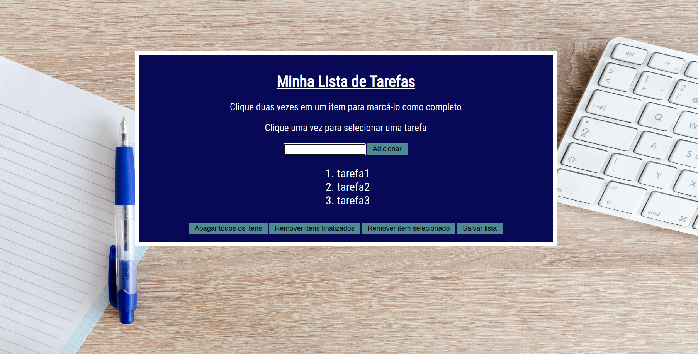

# Welcome to the repository to-do list!

This was one of the firsts projects using HTML, CSS and JavaScript. This project is a website that is a to-do list. The user can add tasks to the list, mark if the task is done, remove the tasks that were finished, remove all the tasks and save the list.



## Requirements of the project

#### 1 - The to-do list should have a header.

#### 2 - The website should have an input element so the user can add the task.

#### 3 - It should have a button so the user can add a task when clicked

#### 4 - The tasks that were added should be on an ordered list.

#### 5 - The tasks should be on the order that they were made.

#### 6 - When an item in the list is clicked it should change the background color of the item.

#### 7 - It should not be possible to select more than one element on the list at the same time.

#### 8 - When a item is clicked twice the item should have a line-through.

#### 9 - It should have a button that remove all the items.

#### 10 - It should have a button that remove the conclude items.

#### 11 - It should have a button that remove the selected item.

#### 12 - It should have a button that saves the list so when the page is refreshed the list stays saved.

## How to install the project
1. Open the terminal and make a directory:

```
mkdir name-of-the-directory
```

2. Go inside the directory and clone the project:
```
cd name-of-the-directory
git clone git@github.com:anacapdeville/to-do-list.git
```

3. Open the directory that was cloned and click twice on the file index.html. The file should open on the browser.